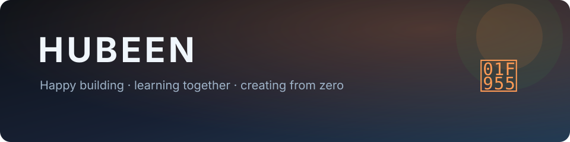

  

  
  
  

### About me

I am happiest when I am building software. I enjoy working with people, learning unfamiliar things, and turning a blank page into something useful.

My roots are in **security and systems**—CTFs, reversing, forensics, and web security—and I now build across web, apps, automation, and macOS. I care as much about the process of creating together as the finished product.

- Led **NIMDA SECURITY**, Kongju National University's security club
- Speaker at **Hacking Camp**, **NIMDA SECURITY**, and the Korea Open Source Software Conference
- Developer of **[Dual Number Helper](https://play.google.com/store/apps/details?id=kr.hubeen.dualnumberhelper)**, an Android app that automatically applies Korean carriers' dual-number dialing rules

### Currently building

<table>
<tr>
<td width="50%" valign="top">

#### [Dual KakaoTalk for macOS](https://github.com/hubeen/dual-kakaotalk-macos)

Run personal and work KakaoTalk side by side, with locally derived green icons and no bundled Kakao assets.

`Swift` `macOS` `CLI`

</td>
<td width="50%" valign="top">

#### [Capsomnia](https://github.com/hubeen/Capsomnia)

Turn Caps Lock into a physical keep-awake switch for closed-lid MacBook work.

`Swift` `AppKit` `macOS`

</td>
</tr>
</table>

### Languages & interests

`Pwnable` `Reversing` `Forensics` `Web Security` `Open Source`

  

